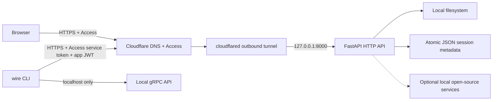

# AGENTS.md — Local-First, No-Cost Public Architecture

## 1. Purpose

This repository is a local-first Python CLI and optional local API/control
panel. The canonical deployment target is a single Ubuntu 24.04 machine. Data,
files, state, model credentials, and application processes remain on that
machine. Public HTTPS access is provided through Cloudflare Tunnel and
Cloudflare Access. Cloudflare configuration is managed with Terraform.

The target is no recurring application-platform charge. "No-cost" means:

- no Amazon S3, managed database, managed Redis, paid queue, paid Kubernetes,
  paid observability backend, or paid application hosting;
- use the Cloudflare free plan only where its current terms support the
  required feature;
- use local disk and open-source processes for application data;
- accept that hardware, disks, electricity, Internet connectivity, domain
  registration, backup media, and operator time are not free.

Never silently introduce a metered service. Any proposal that can create a
bill requires explicit user approval and a documented cost ceiling.

## 2. Communication and Asset Language

- Always communicate with users in Thai.
- All source code, identifiers, comments, configuration, commit messages,
  diagrams, technical documentation, and generated assets must be in English.
- Explain assumptions, risk, and operational tradeoffs in Thai to the user.
- Do not claim a component is production-ready without executable evidence.

## 3. Source of Truth and Precedence

Use this order when requirements conflict:

1. System and user instructions.
2. This `AGENTS.md`.
3. The actual source code and executable tests.
4. `ARCHITECTURE.md`, `README.md`, and files under `docs/`.
5. Historical implementation reports.

Historical reports are not proof that a feature is active. Verify runtime
wiring, tests, configuration, and deployment manifests before reporting status.

Cloudflare products, Terraform schemas, free-plan limits, and security guidance
change frequently. Before modifying Cloudflare or Terraform code:

1. retrieve current official Cloudflare documentation;
2. retrieve the current Cloudflare Terraform provider schema;
3. prefer official documentation and registry pages over memory;
4. record a provider constraint and commit the generated lock file;
5. run `terraform validate` and inspect `terraform plan`.

## 4. Canonical Architecture



Architectural invariants:

- The application binds to `127.0.0.1`, never `0.0.0.0`, in the canonical
  public-local profile.
- The router exposes no inbound port to the Internet.
- `cloudflared` creates outbound-only connections to Cloudflare.
- Only the HTTP API and control panel are published by default.
- gRPC remains localhost-only unless a separately reviewed design proves
  transport, authentication, request limits, and Cloudflare compatibility.
- A final tunnel ingress rule must return `http_status:404`.
- Public hostnames must have a Cloudflare Access application before the tunnel
  route becomes active.
- Cloudflare Access is an outer identity-aware proxy, not a replacement for
  application authorization.
- Mutating API routes still require application JWT/RBAC and tenant checks.
- Files and persistent metadata never move to Cloudflare R2, KV, D1, Queues,
  or another billed storage product without explicit approval.

## 5. Canonical Local Runtime

The dependency-free profile is the default:

```text
Storage             local filesystem
Upload metadata     atomic JSON files
Process cache       in-memory L1
Shared cache        disabled
Queue               disabled
Tracing exporter    disabled
Authentication      enabled for public mode
HTTP bind           127.0.0.1:8000
gRPC bind           127.0.0.1:8001
Workers             1
```

Local-only development may disable authentication. Public-local mode must not.

Required local directories:

```text
data/
└── uploads/
    ├── chunks/
    ├── files/
    └── sessions/
```

Required behavior:

- Create directories with restrictive permissions.
- Persist upload session metadata through atomic write-and-rename.
- Verify every chunk with BLAKE3.
- Validate chunk index, expected size, session ownership, total file size, and
  configured limits.
- Assemble into a temporary file.
- Verify final length and whole-file BLAKE3 before atomic publication.
- Never return a path outside the configured storage root.
- Never treat an unscanned public upload as safe.
- Do not load a complete large object into memory.

Optional local open-source services may be enabled when the machine has enough
resources:

| Capability | Preferred component | Default |
|---|---|---|
| Shared cache and rate limits | Valkey | Off |
| Durable event queue | NATS JetStream | Off |
| Relational metadata | PostgreSQL | Off |
| Malware scanning | ClamAV | Off; uploads remain quarantined |
| Metrics | Prometheus | Off |
| Dashboards | Grafana | Off |
| Logs | Loki | Off |
| Traces | Tempo + OpenTelemetry Collector | Off |

These services must run locally and must not depend on a paid hosted control
plane.

## 6. Runtime Profiles

### 6.1 Local development

Use only on a trusted machine:

```env
ENVIRONMENT=development
DEBUG=true
AUTH_REQUIRED=false
STORAGE_BACKEND=local
UPLOAD_TEMP_DIR=./data/uploads
REDIS_ENABLED=false
NATS_ENABLED=false
OTEL_ENABLED=false
API_HOST=127.0.0.1
API_PORT=8000
API_WORKERS=1
```

### 6.2 Local origin exposed through Cloudflare

This is the canonical online profile:

```env
ENVIRONMENT=production
DEBUG=false
AUTH_REQUIRED=true
STORAGE_BACKEND=local
UPLOAD_TEMP_DIR=./data/uploads
REDIS_ENABLED=false
NATS_ENABLED=false
OTEL_ENABLED=false
API_HOST=127.0.0.1
API_PORT=8000
API_WORKERS=1
RATE_LIMIT_ENABLED=true
CONTROL_PANEL_ENABLED=true
JWT_SECRET=<generated-secret>
E2E_SECRET_KEY=<base64-encoded-32-byte-key>
CORS_ORIGINS=https://wire.example.com
CLOUDFLARE_ACCESS_TEAM_DOMAIN=https://team-name.cloudflareaccess.com
CLOUDFLARE_ACCESS_AUD=<application-audience-tag>
```

Secrets must be supplied through environment variables, an ignored permission
restricted file, SOPS-encrypted material, or a local secret manager. Never
commit real values.

## 7. Cloudflare Boundary

Use these Cloudflare capabilities only:

- authoritative DNS for the selected hostname;
- Cloudflare Tunnel for outbound-only origin connectivity;
- Cloudflare Access for deny-by-default user and machine authentication;
- standard proxy TLS and baseline free-plan protections;
- Terraform API management.

Do not add R2, Workers, Pages, D1, KV, Queues, Images, Stream, Argo Smart
Routing, Load Balancing, Browser Isolation, or another potentially metered
product without user approval.

### 7.1 Tunnel requirements

- Prefer a remotely managed named tunnel.
- Store the tunnel token outside Terraform variables committed to Git.
- Run `cloudflared` with a token file when supported, or inject
  `TUNNEL_TOKEN` through the process environment.
- Never put the token on a command line that is visible in process listings.
- Route the application hostname to `http://127.0.0.1:8000`.
- Configure `origin_request.access.required = true`.
- Configure the Access team name and application audience tag.
- End ingress with `http_status:404`.
- Allow outbound TCP/UDP port 7844 as required by the selected tunnel protocol.
- Do not open inbound ports 8000 or 8001 in the host firewall.
- Do not use a Quick Tunnel for authenticated or persistent use.

### 7.2 Access requirements

- Create Access before activating the public tunnel hostname.
- Default policy is deny.
- Allow only explicit email addresses, identity-provider groups, or service
  tokens.
- Never use an `everyone` or `all valid emails` allow rule.
- Require MFA where supported by the selected free plan and identity provider.
- Keep browser session duration short enough for the risk profile.
- Use a separate service-auth policy for CLI automation.
- Return HTTP 401 for missing machine credentials where supported.
- Validate the `Cf-Access-Jwt-Assertion` signature and audience at the origin,
  or require cloudflared Access validation.
- A header's presence alone is not authentication.
- Strip or ignore spoofable client-supplied identity headers.

### 7.3 Two-layer authorization

For browser requests:

```text
Cloudflare Access user authentication
→ validated Access JWT
→ application role mapping
→ tenant/resource authorization
```

For CLI requests:

```text
Cloudflare Access service token
→ application bearer JWT
→ role and tenant authorization
→ operation-specific validation
```

Cloudflare identity decides who may reach the origin. Application identity
decides what the caller may do.

## 8. Terraform Contract

Cloudflare Terraform code belongs under:

```text
infra/
└── cloudflare/
    ├── versions.tf
    ├── providers.tf
    ├── variables.tf
    ├── main.tf
    ├── outputs.tf
    ├── terraform.tfvars.example
    └── README.md
```

Use Cloudflare provider v5 syntax. Pin a compatible minor range and commit
`.terraform.lock.hcl`. Do not copy v4 examples into v5 configuration.

Terraform owns:

- the proxied DNS record for the application hostname;
- the remotely managed Cloudflare Tunnel;
- tunnel ingress configuration;
- the Cloudflare Access self-hosted application;
- explicit user and service-auth policies;
- optional reusable Access policies when appropriate.

Expected provider resources must be confirmed against the current registry,
but the preferred v5 resource families are:

```text
cloudflare_zero_trust_tunnel_cloudflared
cloudflare_zero_trust_tunnel_cloudflared_config
cloudflare_zero_trust_access_application
cloudflare_zero_trust_access_policy
cloudflare_dns_record
```

### 8.1 Terraform authentication

Use a scoped Cloudflare API token through:

```env
CLOUDFLARE_API_TOKEN=<scoped-token>
```

Grant only the permissions required for:

- Tunnel edit;
- Access applications and policies edit;
- DNS edit for the selected zone;
- account and zone read where required by provider lookups.

Do not use a Global API Key.

### 8.2 Variables

Non-secret variables may include:

```text
cloudflare_account_id
cloudflare_zone_id
zone_name
application_hostname
access_team_name
allowed_emails
session_duration
local_origin_url
```

Mark all credential-like variables `sensitive = true`. Do not put these in a
tracked `.tfvars` file:

```text
cloudflare_api_token
tunnel_token
service_token_client_secret
application JWT secret
encryption key
```

### 8.3 Terraform state

Terraform state can contain sensitive values.

- Never commit `terraform.tfstate`, backups, plans, crash logs, or `.terraform/`.
- For a no-cost single-operator setup, use local state on encrypted disk and
  back it up to encrypted offline media.
- Set restrictive file permissions.
- Do not invent a free remote backend by storing state in a public repository.
- Migrating state to a paid or hosted backend requires explicit approval.

### 8.4 Safe workflow

Read-only operations are allowed without approval:

```bash
terraform fmt -check -recursive
terraform init -backend=false
terraform validate
terraform plan -out=tfplan
terraform show tfplan
```

`terraform apply`, `destroy`, import operations, state mutation, token
creation, DNS changes, Tunnel creation, and Access policy changes are external
actions. They require explicit user approval immediately before execution.

Never auto-approve a destructive or public exposure change.

## 9. Bootstrap Procedure

The first setup contains unavoidable account-specific steps:

1. Add an owned domain to Cloudflare.
2. Confirm the domain is active.
3. Create a scoped Terraform API token.
4. Configure a Cloudflare Zero Trust organization/team domain.
5. Select an identity provider or the supported one-time PIN flow.
6. Prepare explicit allowed user emails or groups.
7. Populate ignored local Terraform variables.
8. Run format, initialize, validate, and plan.
9. Review the plan for unexpected paid products or broad access.
10. Obtain explicit user approval.
11. Apply Terraform.
12. Retrieve the tunnel token without printing or committing it.
13. Store the token in a permission-restricted local file or environment.
14. Start the local application on `127.0.0.1:8000`.
15. Start `cloudflared`.
16. Verify Access denies an unauthenticated browser and CLI.
17. Verify allowed identities can reach only authorized routes.
18. Verify ports 8000 and 8001 are unreachable from another LAN host.

## 10. Security Requirements

### 10.1 Secrets

- No hardcoded credentials.
- No default passwords.
- No random per-process production JWT or encryption keys.
- Fail startup when required production secrets are absent.
- Redact tokens and authorization headers from logs.
- Rotate a tunnel token immediately if exposed.
- Treat Terraform plan and state files as secrets.

### 10.2 HTTP

- Production CORS uses exact HTTPS origins.
- Never combine wildcard origins with credentials.
- Enforce request body and upload limits.
- Add HSTS, `nosniff`, frame denial, strict referrer policy, and a restrictive
  content security policy.
- Do not expose debug docs in production.
- Do not trust `X-Forwarded-For` unless the request came through the expected
  local proxy path.
- Rate limiting must fail closed in public production mode when its
  authoritative backend is required.

### 10.3 Files

- Validate opaque identifiers with allowlists.
- Prevent path traversal and symlink escape.
- Namespace chunks and sessions by tenant.
- Use atomic create/rename patterns.
- Verify both chunk and final file digests.
- Keep quarantined files unavailable for download.
- Do not serve arbitrary local paths.
- Apply retention and disk-space limits.

### 10.4 Process isolation

- Run the application and `cloudflared` as non-root users.
- Use separate service users where practical.
- Restrict write access to the upload directory.
- Restrict tunnel-token read access to the cloudflared service user.
- Use systemd hardening when installing persistent services.
- Do not grant Docker socket access to the application.

## 11. Public API Rules

- Health liveness may be reachable without application authentication only if
  Cloudflare Access still protects the hostname.
- Readiness must not disclose credentials, internal addresses, or stack traces.
- Upload initialization, chunk upload, finalization, cancellation, metrics,
  feature flags, and control-panel operations require authorization.
- Errors exposed publicly must be stable, sanitized, and correlation-ID based.
- Never return raw exception strings for unexpected failures.
- Use idempotency keys for retried mutating requests.
- Public endpoints need explicit timeout and size budgets.

## 12. Performance Rules

- Do not promise sub-millisecond Internet latency.
- Define latency separately for local processing, local network, tunnel edge,
  and end-to-end requests.
- Stream large payloads; do not buffer complete files in RAM.
- Reuse HTTP/gRPC connections.
- Keep public HTTP request sizes within verified Cloudflare limits.
- Benchmark through the tunnel, not only against localhost.
- Record p50, p95, p99, throughput, memory, disk I/O, and error rate.
- Cloudflare plan limits must be retrieved from official documentation before
  setting upload defaults.

## 13. Observability

The no-cost default is structured local logs plus local health endpoints.

- Emit JSON logs in public mode.
- Include timestamp, request ID, subject, tenant, action, resource, outcome,
  duration, and trace ID where available.
- Never log bearer tokens, Access assertions, cookies, tunnel tokens, file
  contents, or Terraform secrets.
- Use log rotation and bounded retention.
- Optional Prometheus/Grafana/Loki/Tempo must remain local.
- Do not enable Cloudflare paid logging or analytics exports without approval.

## 14. Testing Requirements

Every security or public-network change needs tests for:

- missing and invalid application bearer tokens;
- wrong role;
- cross-tenant session access;
- invalid Cloudflare Access audience;
- invalid Access JWT signature;
- expired Access JWT;
- missing Access assertion in public mode;
- path traversal;
- negative and oversized chunk indices;
- incorrect chunk size and digest;
- incorrect final size and digest;
- restart-safe local upload resume;
- atomic finalization cleanup;
- CORS rejection;
- sanitized errors;
- tunnel ingress catch-all behavior;
- Terraform variable validation.

Required local verification:

```bash
pytest -q
ruff check app tests
python -m compileall -q app src/wire webapp/backend
git diff --check
terraform -chdir=infra/cloudflare fmt -check -recursive
terraform -chdir=infra/cloudflare init -backend=false
terraform -chdir=infra/cloudflare validate
```

When tools are installed, also run:

```bash
gitleaks detect --no-banner --redact --no-git --source app
cloudflared tunnel ingress validate
```

Do not report a cluster, tunnel, DNS record, Access policy, or public URL as
working unless it was verified against the real external state.

## 15. External Action Boundaries

Network tools are read-only by default. Search, inspect, validate, and draft
freely within scope.

Explicit approval is required before:

- `terraform apply` or `terraform destroy`;
- creating, changing, or deleting DNS records;
- creating, rotating, or deleting API/tunnel/service tokens;
- making a hostname publicly routable;
- changing Cloudflare Access policies;
- publishing images or releases;
- opening firewall ports;
- pushing commits or merging pull requests.

If approval is absent, produce local Terraform code, validation output, and a
reviewable plan without applying it.

## 16. Repository Conventions

- Python file names use `snake_case`.
- Prefer relative imports within packages.
- Define `__all__` for new reusable modules.
- Preserve unrelated worktree changes.
- Use `apply_patch` for edits.
- Add or update tests with behavior changes.
- Review the scoped diff before handoff.
- Never commit `.env`, `.env.local`, `.env.cloudflare`, tunnel credentials,
  private keys, Terraform state, plan files, or generated secret material.

Expected ignore patterns:

```gitignore
.env
.env.*
!.env.example
!.env.*.example
.cloudflared/
*.pem
infra/cloudflare/.terraform/
infra/cloudflare/*.tfstate
infra/cloudflare/*.tfstate.*
infra/cloudflare/*.tfplan
infra/cloudflare/crash.log
infra/cloudflare/*.auto.tfvars
```

## 17. Definition of Done

A local-public Cloudflare change is complete only when:

- source behavior matches this document;
- no paid dependency was introduced;
- the application binds only to localhost;
- Access is deny-by-default;
- both Cloudflare and application authorization are enforced;
- secrets are absent from source, diff, logs, and Terraform state committed to
  Git;
- tests, lint, compilation, and Terraform validation pass;
- the Terraform plan contains only expected resources;
- public exposure was applied only after explicit approval;
- unauthenticated access is denied in a real external smoke test;
- rollback instructions exist;
- documentation identifies remaining operational costs and limitations.

## 18. Authoritative References

Verify these before implementation because schemas and limits change:

- Cloudflare Tunnel:
  `https://developers.cloudflare.com/cloudflare-one/networks/connectors/cloudflare-tunnel/`
- Publish a self-hosted application:
  `https://developers.cloudflare.com/cloudflare-one/access-controls/applications/http-apps/self-hosted-public-app/`
- Validate Access JWTs:
  `https://developers.cloudflare.com/cloudflare-one/access-controls/applications/http-apps/authorization-cookie/validating-json/`
- Tunnel firewall requirements:
  `https://developers.cloudflare.com/cloudflare-one/networks/connectors/cloudflare-tunnel/configure-tunnels/tunnel-with-firewall/`
- Cloudflare Terraform provider:
  `https://registry.terraform.io/providers/cloudflare/cloudflare/latest/docs`
- Cloudflare Terraform changelog:
  `https://developers.cloudflare.com/changelog/product/terraform/`

---

Document version: 2.0.0

Architecture: Local-first, Cloudflare-published, Terraform-managed

Last updated: 2026-07-19
